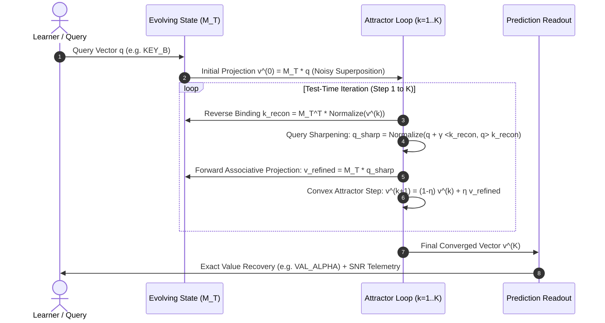

# Architecture Diagrams & Dataflow Pipelines

**Project:** EvoState (DataForge 2026 Pathway Track)  
**Modules:** Core Engine, Model Baselines, State Evolution, and Inference Scaling

---

## 🏛️ 1. High-Level System Architecture

```mermaid
graph TD
    User["Learner / Researcher"] -->|Interactive Controls (L, M, p, K)| UI["Next.js 15+ Frontend (/lab, /bdh, /bdh-cq)"]
    
    UI -->|Option A: Live REST API| FastAPI["FastAPI Service (Port 8000)"]
    UI -->|Option B: Offline Client Simulator| WASM["Client-Side Tensor Simulator (simulator.ts)"]
    
    FastAPI --> Engine["PyTorch Computational Engine (evostate/)"]
    
    Engine --> ModelA["Full-History Reference Baseline (KV Cache)"]
    Engine --> ModelB["Fixed-Size Recurrent Baseline (Scalar Decay)"]
    Engine --> ModelC["Educational Evolving Toy (Matrix Memory)"]
    
    Engine --> Telemetry["State Traces: Norms, Entropy, SNR (dB), Coordinates"]
    Telemetry --> D3["D3.js Interactive Visualizers & Heatmaps"]
    
    Precomputed["Precomputed Sweeps (2,700 Trials)"] -->|Static JSON/CSV/PNG| UI
```

---

## 🔄 2. Model Memory Dataflow Comparison

### A. Full-History Transformer KV-Cache ($\mathcal{O}(T \cdot d)$)
```
Input Token x_t ───► [ K_t = W_k x_t, V_t = W_v x_t ] ───► Append to Buffer
                                                                  │
Buffer Size Grows Linearly with T:                                │
[ (k_1, v_1), (k_2, v_2), ... , (k_T, v_T) ] ◄────────────────────┘
                                │
Query q ────────────────────────┴──► Attention: softmax(q K^T / sqrt(d)) V ──► Output y
```

### B. Fixed-Size Recurrent Vector State ($\mathcal{O}(d)$)
```
Input Token x_t ───► h_t = (1 - decay) * h_{t-1} + W_in x_t  (Single Vector)
                                │
Query q ────────────────────────┴──► Linear Readout: W_out h_T ──► Output y
```

### C. Educational Evolving-Memory Toy Model ($\mathcal{O}(d_v \times d_k)$)
```
Input Token x_t ───► [ k_t = W_k x_t, v_t = W_v x_t, Δ_t = σ(W_Δ x_t) ]
                                │
Update Equation:                ▼
M_t = λ_t M_{t-1} + Δ_t (v_t ⊗ k_t^T)   (Associative Matrix Fast Weights)
                                │
                                ▼
Query q ──────────► [ Inference-Time Attractor Settling ]
                          │
                          ▼
            v^(0) = M_T q ──► k_recon = M_T^T v^(k) ──► q_sharp
                          │
                          ▼
            v^(k+1) = (1 - η) v^(k) + η M_T q_sharp^(k)
                          │
                          ▼
            Cosine Similarity against Codebook ──► Output y*
```

---

## ⚡ 3. Inference-Time Attractor Settling (BDH-CQ Probing)



---

## 🎨 4. Frontend Component & Page Routing Hierarchy

```
frontend/src/
├── app/
│   ├── layout.tsx              (Global scientific shell, dark theme, navigation header)
│   ├── page.tsx                (Home: Immediate proof of concept & 60s experiment)
│   ├── lab/page.tsx            (EvoLab Workbench: 3 Modes: 60s, Guided 7-Stage, Open Lab)
│   ├── concept/page.tsx        (Theory: Mathematical formalisms & 5x8 comparison)
│   ├── bdh/page.tsx            (BDH Standard: Primary sources, synapse duality, limits)
│   ├── bdh-cq/page.tsx         (BDH-CQ: 3-tier adaptation, energy landscape, Pareto chart)
│   ├── research/page.tsx       (Research: 2,700 trials, 7 plots, CSV/JSON downloads)
│   └── about/page.tsx          (Defense: 6 critical judge defense FAQs & specification)
├── components/
│   ├── SixtySecondExperiment.tsx      (Dedicated 60-second rapid learning journey)
│   ├── GuidedPathwayLab.tsx          (7-stage guided pedagogical discovery)
│   ├── InternalStateStepVisualizer.tsx(Step-by-step scrubber & D3 heatmap)
│   ├── D3CostAccuracyChart.tsx       (Interactive D3 Pareto frontier)
│   ├── D3EnergyLandscape.tsx         (Interactive D3 attractor landscape)
│   ├── RigorousArchitectureComparison.tsx (5x8 literature matrix with badges)
│   └── StateVectorVisualizer.tsx     (D3 SNR line telemetry)
└── lib/
    ├── api.ts                  (FastAPI client with automatic fallback)
    └── simulator.ts            (High-fidelity client-side tensor simulator)
```
